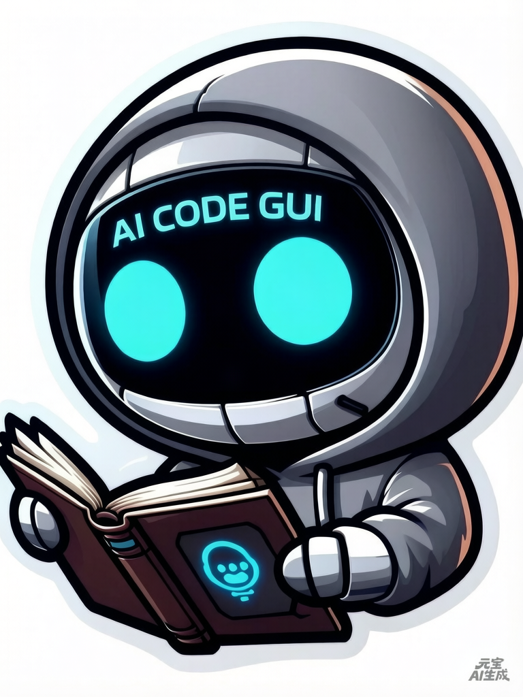

<div align="center">

# AI Code GUI

> Originally Claude Code GUI



**English** · [简体中文](./README.zh-CN.md)

<a href="https://trendshift.io/repositories/24968" target="_blank"></a>

![][github-contributors-shield] ![][github-forks-shield] ![][github-stars-shield] ![][github-issues-shield] ![][github-mit]

</div>

> Originally Claude Code GUI, now renamed to AI Code GUI to support multiple AI coding tools. Regarding security, a /security-review audit will be conducted before each minor version release, and a comprehensive claude-code-security audit will be performed every 10 minor versions. 

A powerful IntelliJ IDEA plugin that provides a visual interface for **Claude Code**, **OpenAI Codex** and more AI coding CLIs, making AI-assisted programming more efficient and intuitive.


---

## Installation

[AI Code GUI Installation](https://plugins.jetbrains.com/plugin/29342-cc-gui-claude-or-codex-)

---

## Key Features

### Multi AI Engine Support
- **Claude Code** - Anthropic's official AI programming assistant, supporting Opus 4.5 and other models
- **OpenAI Codex** - OpenAI's powerful code generation engine
- **Grok CLI** (Beta) - xAI's command-line coding assistant
- **Kimi CLI** (Beta) - Moonshot AI's command-line coding assistant
- **OpenCode** (Beta) - open-source AI coding agent for the terminal
- **PI CLI** (Beta) - PI command-line coding assistant
- **OMP CLI** (Beta) - OMP command-line coding assistant
- **DeepSeek Harness** (Beta) - DeepSeek's command-line coding harness

### Intelligent Conversation
- Context-aware AI coding assistant
- @file reference support for precise code context
- Image sending support for visual requirement description
- Conversation rewind feature for flexible history adjustment
- Enhanced prompts for better AI understanding

### Agent System
- Built-in Agent system for automated complex tasks
- Skills slash command system (/init, /review, etc.)
- MCP server support to extend AI capabilities

### Developer Experience
- Comprehensive permission management and security controls
- Code DIFF comparison feature
- File navigation and code jumping
- Dark/Light theme switching
- Font scaling and IDE font synchronization
- Internationalization support (auto-switch between Chinese/English)

### Session Management
- History session records and search
- Session favorites
- Message export support
- Provider management (cc-switch compatible)
- Usage statistics analysis

---

## Architecture

The project adopts a **three-layer runtime architecture**:

### Layers

- **Backend** — IntelliJ plugin (Java, `src/main/java/com/github/claudecodegui/`). Hosts all business logic, authoritative state, and persistence. Implements strict separation of concerns: every business calculation, capability judgment, data normalization, and decision lives here.
- **Frontend** — React + TypeScript webview (`webview/`). Embedded via JCEF, responsible **only** for rendering and input collection. No business logic, no hardcoded business data tables, no capability judgment functions.
- **ai-bridge** — Independent Node.js process (`ai-bridge/`). Handles CLI process management and message streaming. Communicates with the backend via NDJSON over stdin/stdout.

### Communication

| Direction | Mechanism | Contract |
|---|---|---|
| Frontend → Backend (upstream) | `window.sendToJava({type, content})` | `UpstreamAction` enum, dispatched via `FrontendActionHandler<T>` |
| Backend → Frontend (downstream) | `window.__bridge.dispatch(type, payload)` | `DownstreamEvent` enum constants |
| Java ↔ ai-bridge | stdin/stdout NDJSON lines | `BaseSDKBridge.executeStreamingCommand` → `channel-manager.js` |

### Design Principles

- **Separation of concerns**: Frontend renders; backend owns all business logic (highest priority).
- **Single Source of Truth (SSOT)**: Protocol message names, payload structures, and enum values are generated from Java enums to frontend TypeScript types via a `prebuild` hook — no hand-written string literals on either side.
- **Open-Closed Principle**: New capabilities are added via strategy registry + adapter interfaces (`FrontendActionHandler<T>`, `ProviderAdapter`, `SessionRuntime`), not by modifying dispatcher core logic.
- **Provider symmetry**: All 3 AI providers (Claude, Codex, OpenCode) × 2 invocation modes (SDK daemon, CLI subprocess) = 6 call paths share equivalent cross-cutting logic (env injection, interrupt/abort, cwd fallback, etc.).

For detailed architecture guidelines, see [AGENTS.md](AGENTS.md).

---

## Project Status

The project is under active development with continuous updates. For version history and iteration progress, please read [CHANGELOG.md](CHANGELOG.md)

---

### Collaborative Contributing

For contributing guidelines, please read [CONTRIBUTING.md](CONTRIBUTING.md)

---


## Local Development and Debugging

### 1. Install Frontend Dependencies

```bash
cd webview
npm install
```

This also runs the `prebuild` hook that generates protocol types from Java enums into `webview/src/generated/protocol.ts`.

### 2. Install ai-bridge Dependencies

```bash
cd ai-bridge
npm install
```

### 3. Compile Backend

```bash
./gradlew compileJava
```

### 4. Debug Plugin

```bash
./gradlew clean runIde
```
3
### 5. Build Plugin

```sh
./gradlew clean buildPlugin

# The generated plugin package will be in the build/distributions/ directory (package size approximately 40MB)
```

---

## License

MIT

---

## Contributing

Thanks to all contributors who help make IDEA-Claude-Code-GUI better!

<a href="https://github.com/zhukunpenglinyutong/jetbrains-cc-gui/graphs/contributors">
  
</a>

---

## Sponsor

If this project is helpful to you, you can invite the author to have a KFC or a cup of coffee~

如果这个项目对你有帮助，想请作者吃顿肯德基（KFC）或者喝杯咖啡，都是可以的~

[View Sponsors List →](./SPONSORS.md)

---

## Friendship Link

Thanks for the support and feedback from the friends at [LINUX DO](https://linux.do/). 

Thank you for [AtomGit](https://atomgit.com/zhukunpenglinyutong/idea-claude-code-gui) platform G-Star certification

---

## Acknowledgements

Recently, many bloggers have recommended this project on their own initiative, and I am deeply grateful. Thanks again to bloggers including "沉默的王二", "macrozheng", "JavaGuide", "Java知音", "鲲鹏talk 公众号", and "程序员青戈" for recommending this project. I will keep iterating to make it more comfortable for everyone to use.

---

## Star History

[](https://star-history.dera.page/#zhukunpenglinyutong/jetbrains-cc-gui&type=date&legend=top-left)

<!-- LINK GROUP -->

[github-contributors-shield]: https://img.shields.io/github/contributors/zhukunpenglinyutong/idea-claude-code-gui?color=c4f042&labelColor=black&style=flat-square
[github-forks-shield]: https://img.shields.io/github/forks/zhukunpenglinyutong/idea-claude-code-gui?color=8ae8ff&labelColor=black&style=flat-square
[github-issues-link]: https://github.com/zhukunpenglinyutong/idea-claude-code-gui/issues
[github-issues-shield]: https://img.shields.io/github/issues/zhukunpenglinyutong/idea-claude-code-gui?color=ff80eb&labelColor=black&style=flat-square
[github-license-link]: https://github.com/zhukunpenglinyutong/idea-claude-code-gui/blob/main/LICENSE
[github-stars-shield]: https://img.shields.io/github/stars/zhukunpenglinyutong/idea-claude-code-gui?color=ffcb47&labelColor=black&style=flat-square
[github-mit]: https://img.shields.io/badge/github-MIT-blue?logo=github
