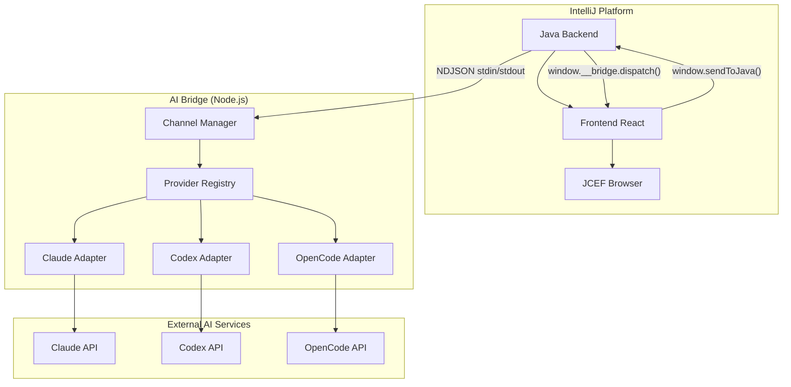

# CC GUI 架构指南

## 1. 插件概述

CC GUI（原名 Claude Code GUI）是一个基于 IntelliJ 平台的插件，为开发者提供 **Claude Code**、**OpenAI Codex** 和 **OpenCode** 三个 AI 工具的可视化操作界面。插件采用三层架构设计，实现了前后端职责分离和灵活的扩展机制。

## 2. 三层架构

插件采用三层运行时架构：

### 2.1 后端（Backend）
- **技术栈**: Java（IntelliJ 插件主体）
- **目录**: `src/main/java/com/github/claudecodegui/`
- **职责**: 承载全部业务逻辑、状态权威与持久化
- **核心模块**:
  - `handler/` - 前端 action 处理器
  - `bridge/` - SDK 桥接层（与 ai-bridge 通信）
  - `provider/` - AI provider 适配器
  - `session/` - 会话管理
  - `settings/` - 配置管理
  - `protocol/` - 协议定义（UpstreamAction/DownstreamEvent）

### 2.2 前端（Frontend）
- **技术栈**: React + TypeScript
- **目录**: `webview/`
- **职责**: 只负责渲染回显与输入采集，无业务逻辑
- **通信**: 通过 JCEF 双向字符串总线与后端通信

### 2.3 AI Bridge
- **技术栈**: Node.js
- **目录**: `ai-bridge/`
- **职责**: CLI 进程管理与消息流处理
- **通信**: 通过 NDJSON 字符串契约与 Java 后端通信

## 3. 通信机制

### 3.1 前端 ↔ 后端（JCEF 总线）
- **上行（前端 → 后端）**: `window.sendToJava({type, content})`
  - type 取值见 `protocol/UpstreamAction` 枚举
- **下行（后端 → 前端）**: `window.__bridge.dispatch(type, payload)`
  - type 取值见 `protocol/DownstreamEvent` 枚举

### 3.2 后端 ↔ AI Bridge（NDJSON）
- **进程边界**: NDJSON 字符串契约，无 Node 类型泄漏
- **启动方式**: `node channel-manager.js <provider> <action>`
- **通信方式**: stdin 投递 JSON，stdout 读取 NDJSON 行

## 4. 协议规范（SSOT）

### 4.1 协议消息名
- **唯一来源**: Java 枚举（`UpstreamAction` / `DownstreamEvent`）
- **生成路径**: `webview/scripts/generate-protocol-types.mjs` 直读 Java 枚举源
- **产物**: `webview/src/generated/protocol.ts` 与 `protocol-manifest.json`
- **消费侧**: 前端必须统一从 `webview/src/generated/protocol.ts` 导入常量

### 4.2 Payload 结构
- **单一来源**: 后端生成或校验到前端
- **禁止**: 前后端各写一套解析器/默认值
- **默认值规则**: 两端一致，以后端为准

## 5. 架构图



## 6. 目录结构

```
jetbrains-melon-cc-gui/
├── src/                          # Java 后端源码
│   └── main/java/com/github/claudecodegui/
│       ├── handler/              # 前端 action 处理器
│       │   └── core/             # FrontendActionHandler 接口
│       ├── bridge/               # SDK 桥接层
│       │   ├── BaseSDKBridge.java
│       │   ├── ClaudeSDKBridge.java
│       │   ├── CodexSDKBridge.java
│       │   └── OpenCodeSDKBridge.java
│       ├── provider/             # Provider 适配器
│       │   ├── ProviderAdapter.java
│       │   └── ProviderRegistry.java
│       ├── protocol/             # 协议枚举定义
│       │   ├── UpstreamAction.java
│       │   └── DownstreamEvent.java
│       └── session/              # 会话管理
├── webview/                      # React 前端
│   ├── src/
│   │   ├── generated/            # 自动生成的协议类型
│   │   │   └── protocol.ts
│   │   └── components/           # React 组件
│   └── scripts/
│       └── generate-protocol-types.mjs
├── ai-bridge/                    # Node.js 进程
│   ├── channels/
│   │   ├── channel-manager.js
│   │   └── provider-registry.js
│   └── package.json
├── docs/                         # 项目文档
├── AGENTS.md                     # 架构开发规范
└── build.gradle                  # 构建配置
```

## 7. 扩展点

### 7.1 新增上行 Action 处理
1. 实现 `FrontendActionHandler<T>` 接口
2. 声明 `UpstreamAction`、`payloadType()`、`handle(T, ctx)`
3. 在 `ChatWindowDelegate.initializeHandlers()` 中注册

### 7.2 新增下行事件
1. 在 `DownstreamEvent` 枚举中添加常量
2. 通过 `HandlerContext.dispatchEvent(type, payloadJson)` 派发

### 7.3 新增 Provider 支持
1. 实现 `ProviderAdapter` 接口
2. 在 `ProviderRegistry` 中注册
3. 实现对应的 SDK Bridge 类

### 7.4 新增 Session Runtime
1. 实现 `SessionRuntime` 接口
2. 在 `SessionRuntimeRegistry` 中注册

## 8. 开发规范

### 8.1 前后端职责分离（最高优先级）
- **前端只做**: 渲染回显、纯 UI 状态、输入采集与转发
- **业务逻辑一律下沉后端**: 数据计算、能力判定、决策、校验等

### 8.2 开闭原则与模块解耦
- 新增能力通过新增实现完成，不修改核心分派逻辑
- 模块之间单向依赖、只依赖抽象

### 8.3 契约层单一真相源（SSOT）
- 协议消息名、payload 结构、枚举值必须有唯一来源
- 禁止前端手写协议字符串字面量

### 8.4 拓展点预留
- 所有可能变化的能力必须预留扩展接口
- 禁止使用 if/else 硬编码分支
- 易变参数外置为配置文件

### 8.5 多 Provider 对称性
- Claude / Codex / OpenCode 在 SDK 与 CLI 两模式下处理逻辑等价
- 每类处理必须覆盖全部 provider × mode 组合

## 9. 开发环境搭建

### 9.1 前端开发
```bash
cd webview
npm install
npm run dev
```

### 9.2 AI Bridge 开发
```bash
cd ai-bridge
npm install
```

### 9.3 插件调试
```bash
./gradlew clean runIde
```

### 9.4 插件构建
```bash
./gradlew clean buildPlugin
# 产物在 build/distributions/ 目录
```

## 10. 测试规范

### 10.1 单元测试
- 纯函数走单元测试
- Platform 耦合代码用源码字符串检查兜底

### 10.2 对称性测试
- 新增/修改 provider 能力时，必须对照另两个 provider 的同项实现
- 补 TDD 验证三者等价

---

*本指南基于 AGENTS.md 架构开发规范，为开发者提供快速上手指导。详细规范请参考 [AGENTS.md](../AGENTS.md)。*